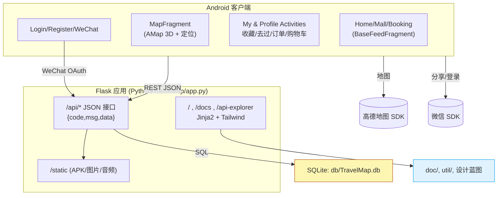

<div align="center">
  <a href="https://github.com/Justtyn/TravelMap">
    
  </a>

  <br>

  <a href="LICENSE">
    
  </a>
</div>


# TravelMap APP

面向课程设计与展示的智慧文旅解决方案，涵盖 Material Design Android 客户端、Flask/SQLite REST 后端、可在线访问的文档中心与静态官网。线上体验环境部署在 <https://canulove.me>，可直接安装 APK 或调试 API。

| 资源 | 路径 / 链接 |
| --- | --- |
| Android 工程 | `Android/` |
| Flask 后端 | `Python/TravelMap/app.py` |
| API 文档（Markdown） | `Android/app/API_DOC.md` / `Python/TravelMap/doc/API_DOC.md` |
| 生产站点 | <https://canulove.me> |
| APK（本地） | `Python/TravelMap/static/TravelMap.apk` |

## 核心亮点
- **一体化业务链路**：覆盖登录、景点导览、旅游商品、订单、收藏、去过打卡、行程规划，客户端 (`Android/app/src/main/java/com/justyn/travelmap/...`) 与后端 (`Python/TravelMap/app.py`) 对应接口完全打通。
- **Material3 + 体验细节**：`BaseFeedFragment` 统一搜索、骨架屏、双击回顶；`MapFragment` 集成高德 3D 地图、定位、Marker 动态加载封面图；`MyFragment` 及二级页面提供 Skeleton、空态、SwipeRefresh。
- **跨端账号体验**：`LoginActivity` 支持本地注册、用户名密码登录、微信授权（`com.justyn.travelmap.wechat.WeChatLoginManager` + `WXEntryActivity`），后端 `/api/auth/wechat` 同步维护 openid。
- **自托管官网 & 文档**：`templates/index.html` + `/docs` + `/features` + `/api-explorer` 展示产品定位、FAQ、接口示例，可在线下载 APK、查看 Markdown 文档（`/docs/view/<file>`）。
- **富静态资源仓库**：`Python/TravelMap/static/` 包含 logo、封面、截图、音频讲解、`TravelMap.apk`；`util/` 下脚本如 `generate_scenic_audio.py`、`update_scenic_covers.py` 可自动化生成素材。

## 界面一览

[](LICENSE)

## 系统架构



## 项目目录结构

```
TravelMap
├─ Android/
│  ├─ app/                         # 客户端源码、布局、API_DOC.md
│  ├─ gradle/libs.versions.toml    # AGP 8.13.1、依赖版本
│  ├─ AGENTS.md / DEV_LOG.md       # 开发规范与日记
│  └─ build.gradle / settings.gradle
├─ Python/TravelMap/
│  ├─ app.py                       # Flask 单文件应用
│  ├─ requirements.txt             # Flask 3.0.2、Werkzeug、requests、dashscope等
│  ├─ db/TravelMap.db & main.sql   # 示例库与结构
│  ├─ doc/                         # API、软件说明书、WeChat 登录说明
│  ├─ static/                      # logo、封面、音频、TravelMap.apk
│  ├─ templates/                   # index.html、banner.html
│  └─ util/                        # 图片/音频批处理脚本
├─ LICENSE                         # MIT
└─ 设计蓝图.md                      # 课设方案、业务策划
```

## 功能清单

### Android 客户端 (`Android/app/src/main/java/com/justyn/travelmap`)
- **认证体系**：`LoginActivity` + `RegisterActivity` 处理账号，`WeChatLoginManager` 封装授权与回调（`wxapi/WXEntryActivity`）。`UserPreferences` 写入 SharedPreferences，启动时在 `MainActivity` 校验。
- **首页 / 商城 / 预订**：`HomeFragment`、`MallFragment`、`BookingFragment` 继承 `BaseFeedFragment`，实现关键字搜索、下拉刷新、Skeleton、Banner、点击跳转至 `ScenicDetailActivity` / `ProductDetailActivity`。
- **地图与行程**：`MapFragment` 结合 `AMap` 定位、`MapMarkerRenderer` 异步加载景点封面、点击 Marker 进入详情；后端 `/api/scenics/map` 提供坐标。
- **个人中心**：`MyFragment` 展示头像、邮箱、快捷入口；`UserInfoActivity` 编辑联系方式；`FavoritesActivity` 切换景点/商品收藏；`VisitedActivity` 打卡列表 + 评分；`CartActivity`、`OrdersActivity`、`OrderDetailActivity`、`OrderSuccessActivity` 完成订单链路。
- **商城闭环**：`UserCenterRepository` 与 `/api/cart`、`/api/orders`、`/api/favorites`、`/api/visited` 等接口交互，按钮附带 `CircularProgressIndicator`，支持收藏/去过幂等操作。
- **Onboarding & Share**：`OnboardingActivity` + `IntroPreferences` 控制首登引导；`Share` 字段在 `res/values/strings.xml` 指向官网 <https://canulove.me>。

### Flask 后端 (`Python/TravelMap/app.py`)
- **统一响应**：所有 `/api/*` 返回 `{code,msg,data}`；错误场景使用业务 code + HTTP code（见 `Android/app/API_DOC.md`）。
- **用户模块**：`/api/auth/register|login|wechat`、`/api/users/<id>`；微信登录真实调用 `WECHAT_OAUTH_URL` 并持久化 `wx_openid`、token。
- **内容模块**：`/api/scenics`（列表/详情）、`/api/scenics/map`（轻量字段）、`/api/products`、`/api/bookings`、`/api/plans`（生成/查询行程）。
- **互动模块**：`/api/favorites`（增删、状态）、`/api/visited`（增删查）、`/api/cart`（增删改查）、`/api/orders`（下单+列表+详情）。
- **静态站点**：`/` (Tailwind 单页)、`/docs`、`/features`、`/api-explorer`（`API_SECTIONS` 数据）；`/docs/file/<name>`、`/docs/view/<name>` 可下载/渲染 Markdown。
- **APK 元数据**：`get_apk_metadata()` 读取 `static/TravelMap.apk` 大小、SHA256、更新时间，供官网展示。

### 文档 / 资产
- 产品方案：`设计蓝图.md`、`Python/TravelMap/doc/SOFTWARE_GUIDE.md`。
- API / 前端协作：`Android/app/API_DOC.md`、`Python/TravelMap/doc/WECHAT_LOGIN_FE.md`。
- 媒体素材：`Python/TravelMap/static/audio/`（景点语音讲解）、`.../cover`、`.../IntroductionPicture`。
- 数据脚本：`Python/TravelMap/util/*.py`（批量补图、填充描述、生成音频）。

## 技术栈

| 层 | 组件 |
| --- | --- |
| Android 客户端 | Java 17、Android SDK 36 (min 33)、Material Components 1.13、AppCompat 1.7、RecyclerView、SwipeRefreshLayout、ViewPager2、Glide 4.16、Facebook Shimmer、AMap 3D Map、WeChat SDK 6.8 |
| 后端 & 文档 | Python 3.11、Flask 3.0.2、Werkzeug 3.0.1、requests、Jinja2、Tailwind CDN、SQLite 3.45 |
| 工具链 | Gradle 8.13、Android Gradle Plugin 8.13.1（`gradle/libs.versions.toml`）、pip + `venv`、`shasum` 校验、Nginx + Gunicorn/Werkzeug Dev Server |

## 快速开始
1. 克隆仓库并拉取子项目：`git clone .../TravelMap && cd TravelMap`.
2. Android 部分用 Android Studio Iguana+ 打开 `Android/`，同步 Gradle。
3. 后端部分进入 `Python/TravelMap/`，按下文创建虚拟环境后启动 `app.py`。
4. 访问 `http://127.0.0.1:5001` 查看官网，`/api/scenics` 等接口可供 App 调试。

## Android 构建指南

### 环境
- 安装 Android Studio (Iguana/Hedgehog) + SDK 33~36，JDK 17。
- `local.properties` 指定 `sdk.dir`，Gradle Wrapper 已配置在 `Android/gradle/wrapper/`。
- 手机需授予网络/定位权限，高德 SDK key 按照 `MapPrivacyHelper` 提示完成合规弹窗。

### 常用命令
```bash
cd Android
./gradlew assembleDebug          # 生成 app/build/outputs/apk/debug/app-debug.apk
./gradlew installDebug           # 安装到已连接设备
./gradlew lint ktlint detekt     # 如需静态检查，可按需添加插件
```

### 关键配置
- **API 地址**：`Android/app/build.gradle` 的 `buildConfigField "API_BASE_URL"`，可切换到本地 `http://10.0.2.2:5001`。
- **微信参数**：同一文件 `WECHAT_APP_ID/SECRET`，需与微信开放平台申请一致；`strings.xml` 的 `wechat_app_id` 用于清单注册。
- **地图隐私**：`com.justyn.travelmap.ui.map.MapPrivacyHelper` 在启动时调用 `LocationPrivacy.showPrivacyStatement`，请确保遵循高德 SDK 合规流程。

## 后端运行指南

### 依赖安装
```bash
cd Python/TravelMap
python3 -m venv .venv
source .venv/bin/activate       # Windows: .venv\Scripts\activate
pip install -r requirements.txt
python app.py                   # 默认监听 0.0.0.0:5001
```

### 数据库与静态资源
- SQLite 数据文件：`Python/TravelMap/db/TravelMap.db`。若需重建，可执行 `sqlite3 TravelMap.db < db/main.sql`。
- 静态资产：`static/` 提供 `logo.(png|svg)`、封面、`styles.css`、`TravelMap.apk`、音频；模板 `templates/` 渲染官网与 Banner。
- 文档：`doc/` 存放 API、DEV_LOG、WECHAT_LOGIN_FE 等，`/docs/view/<file>` 可在浏览器阅读。

### 常用环境变量
- `WECHAT_OAUTH_URL`、`WECHAT_USERINFO_URL`、`WECHAT_HTTP_TIMEOUT`：自定义微信接口。
- `ANDROID_VERSION` 由 `app.py` 内常量控制，可同步到官网展示。

## 生产部署指南
1. **WSGI 服务**：在服务器（Ubuntu/Debian）中执行
   ```bash
   cd /srv/TravelMap/Python/TravelMap
   /opt/venv/bin/gunicorn -w 4 -b 0.0.0.0:5001 app:app
   ```
   或使用 `waitress-serve --port=5001 app:app`。
2. **Nginx 反向代理**（示例）
   ```nginx
   server {
       listen 80;
       server_name canulove.me;
   
       location /static/ { alias /srv/TravelMap/Python/TravelMap/static/; }
       location /docs/file/ { try_files $uri @app; }
       location / {
           proxy_pass http://127.0.0.1:5001;
           proxy_set_header Host $host;
           proxy_set_header X-Forwarded-For $proxy_add_x_forwarded_for;
       }
   }
   ```
3. **APK & 文档更新**：将新 APK 覆盖 `static/TravelMap.apk`，`app.py` 的 `get_apk_metadata()` 会自动更新大小/SHA；文档直接放入 `doc/` 并通过 `/docs/view/<name>` 暴露。
4. **线上状态**：当前版本部署在 `https://canulove.me`，应用默认 `BuildConfig.API_BASE_URL = "http://139.59.227.54:5001"` 指向公网实例。

## API 文档导航
- `Android/app/API_DOC.md`：联调同学使用，覆盖 7 大模块（认证/景点/商品/收藏/去过/购物车/订单）。
- `Python/TravelMap/doc/API_DOC.md`：与上文一致，可配合 `/docs/file/API_DOC.md` 下载。
- 在线 Explorer：部署后访问 `/api-explorer`，自动读取 `API_SECTIONS`，支持示例参数。
- 其它文档：`Python/TravelMap/doc/SOFTWARE_GUIDE.md`、`.../DEV_LOG.md`、`.../WECHAT_LOGIN_FE.md`、`设计蓝图.md`。

## APK 下载与校验

| 渠道 | 位置 | 体积 | SHA256 |
| --- | --- | --- | --- |
| 本地构建产物 | `Python/TravelMap/static/TravelMap.apk` | 50.54 MB | `21941e6f66f005c431897654811782d3ffbf9f8b143fdcb31f33bf27c6381547` |
| 线上静态资源 | <https://canulove.me/static/TravelMap.apk> | 同步于上 | 同上 |

校验命令：`shasum -a 256 Python/TravelMap/static/TravelMap.apk`。官网首页将自动展示文件名、版本（`ANDROID_VERSION`）、更新时间。

## 数据库结构快照

| 表 | 描述 | 关键字段 |
| --- | --- | --- |
| `user` | 账号、微信鉴权数据 | `login_type`, `username`, `wx_openid`, `phone`, `email` |
| `scenic` | 景点信息 | `name`, `city`, `latitude`, `audio_url`, `cover_image` |
| `product` | 门票/酒店/周边 | `type (TICKET/HOTEL/TRAVEL)`, `price`, `stock`, `hotel_address` |
| `favorite` | 收藏记录 | `user_id`, `target_type`, `target_id` |
| `visited` | 去过/打卡 | `user_id`, `scenic_id`, `visit_date`, `rating` |
| `plan` | 行程规划 | `user_id`, `title`, `nodes(json)` |
| `cart_item` | 购物车 | `user_id`, `product_id`, `quantity` |
| `order` + `order_item` | 订单与明细 | `order_no`, `order_type`, `status`, `total_price` |

完整建表语句与示例数据见 `Python/TravelMap/db/main.sql`。

## 版本说明

| 版本 / 提交 | 日期 | 说明 | 参考文件 |
| --- | --- | --- | --- |
| Android `versionName 1.0` | 2025-11-19 | 首个正式版客户端：五大 Tab、购物车/订单闭环、WeChat 登录、高德地图 (`Android/app/build.gradle`) | `Android/app/src/main/...` |
| Web/Backend `ANDROID_VERSION=0.9.2-beta` | 2025-11-19 | 官网上线、APK 元数据展示、API Explorer、微信 OAuth 后端 (`Python/TravelMap/app.py`) | `templates/index.html`, `doc/` |
| `b96fc80` | 2025-11-19 | 更新官网 `index.html` 与静态资源，强化动画与导航 | `Python/TravelMap/templates/index.html` |
| `4a95c72` | 2025-11-19 | 添加景点语音讲解与音频资源 | `Python/TravelMap/static/audio/`, `util/generate_scenic_audio.py` |

更多细节可参考 `Android/DEV_LOG.md` 与 `Python/TravelMap/doc/DEV_LOG.md`。

## FAQ
- **如何将 App 指向本地后端？** 修改 `Android/app/build.gradle` 的 `API_BASE_URL`，重新构建或在 Android Studio 中执行 `BuildConfig.API_BASE_URL` Override；若在模拟器，请使用 `10.0.2.2`。
- **微信登录失败怎么办？** 确认 `WECHAT_APP_ID/SECRET`（同文件）与微信开放平台一致，并在微信开放平台配置签名证书；后端需可访问外网以调用 `WECHAT_OAUTH_URL`。
- **地图页空白或定位失败？** 检查是否授予 `ACCESS_FINE_LOCATION/ACCESS_COARSE_LOCATION`，并完成高德 SDK 隐私弹窗（由 `MapPrivacyHelper` 触发）；如需使用自有 key，可在 `AndroidManifest` 中加入 `com.amap.api.v2.apikey`。
- **如何重置示例数据？** 停止后端，删除 `db/TravelMap.db`，执行 `sqlite3 db/TravelMap.db < db/main.sql`；必要时运行 `util/update_*` 脚本重新生成封面/描述。

## License

本项目基于 [MIT License](LICENSE) 开源，可自由使用、修改与分发，引用时请保留原作者声明。
